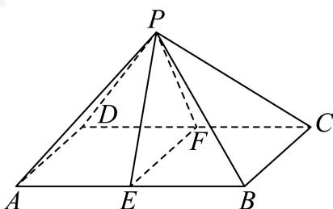

> [!faq]- 2023-2024学年内蒙古包头高一下学期期末数学试卷解析
>
> > [!success]- **【答案】** 详见解析 (2) $\frac{\sqrt{3}}{3}$
>
> > [!note]- **【分析】**
> > （1）根据线面平行的判定定理证明；
>
> > [!note]- **【解析】**
> > （1）因为四边形ABCD为正方形。
> >
> > 所以 $AB // CD$
> >
> > 又 $CD \subset$ 平面PCD， $AB \not\subset$ 平面PCD，
> >
> > 所以 $AB$ //平面PCD.
> >
> > (2) 取 $CD$ 中点 $\pmb{F}$ , 连接 $EF, PF$ ,
> >
> > 
> >
> > 则 $EF//BC$ ，且EF=BC=2，
> >
> > 即 $\angle PEF$ （或补角）为异面直线 $PE$ 与 $BC$ 所成角，
> >
> > 因为 $PF = PE = \sqrt{PA^2 - AE^2} = \sqrt{4 - 1} = \sqrt{3},$
> >
> > $$
> > \cos \angle P E F = \frac {P E ^ {2} + E F ^ {2} - P F ^ {2}}{2 P E \cdot E F} = \frac {4}{2 \times 2 \times \sqrt {3}} = \frac {\sqrt {3}}{3}
> > $$
> >
> > 即异面直线PE与BC所成角的余弦w值为 $\frac{\sqrt{3}}{3}$ .
