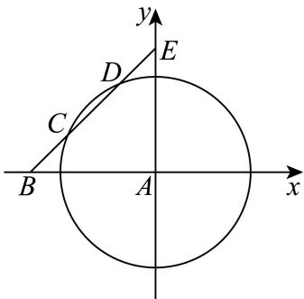

> [!faq]- 2023-2024学年内蒙古包头高一下学期期末数学试卷解析
>
> > [!success]- **【答案】** 详见解析
>
> > [!note]- **【分析】**
> > 根据题意建立数学模型，即台风中心到达B点时开始受影响，计算出直线与圆相交的弦长BC，利用对称性得到AB，再计算开始影响时间即可.
>
> > [!note]- **【解析】**
> > 详见解析
> >
> > 以气象台A为原点建立直角坐标系，
> >
> > 
> >
> > 则台风中心移动的轨迹在直线 $l_{BE}:y=x+200$ 上，
> >
> > 距离气象台 $150\mathrm{km}$ 的轨迹为 $x^{2} + y^{2} = 150^{2}$
> >
> > 则台风中心经过图中弦 $CD$ 时，气象台会受到影响，
> >
> > 又原点到直线 $BE$ 的距离 $\pmb{d} = \frac{200}{\sqrt{2}} = 100\sqrt{2}$ ，所以弦
> >
> > $$
> > C D = 2 \sqrt {1 5 0 ^ {2} - (1 0 0 \sqrt {2}) ^ {2}} = 1 0 0,
> > $$
> >
> > $$
> > B C = \frac {B E - C D}{2} = 1 0 0 \sqrt {2} - 5 0
> > $$
> >
> > 设经过时间 $t_{1}$ 后开始影响，持续时间为 $t_{2}$
> >
> > 则 $25t_{1} = 100\sqrt{2} - 50 \Rightarrow t_{1} = 4\sqrt{2} - 2, 25t_{2} = 100 \Rightarrow t_{2} = 4,$
> >
> > 所以气象台所在地大约 $4\sqrt{2} - 2$ 小时后受到影响，持续时间为4小时.
