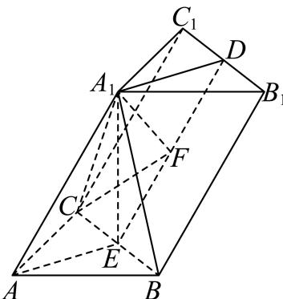

> [!faq]- 2023-2024学年内蒙古包头高一下学期期末数学试卷解析
>
> > [!success]- **【答案】** 详见解析 (2) $\frac{\sqrt{7}}{8}$
>
> > [!note]- **【分析】**
> > （1）利用线面垂直的定义得到线线垂直，根据线面垂直的判定证明直线与平面垂直；
>
> > [!note]- **【解析】**
> > （1）连接AE，
> > 因为 $A_{1}E \perp$ 平面ABC， $AE \subset$ 平面ABC，所以 $A_{1}E \perp AE$ .
> > 因为AB = AC，E为BC的中点，所以AE⊥BC，
> > 又 $BC \cap A_{1}E = E, BC, A_{1}E \subset$ 平面 $A_{1}BC$ ，所以AE⊥平面 $A_{1}BC$ 。
> > 由D，E分别为 $B_{1}C_{1}, BC$ 的中点，得 $DE//BB_{1}$ 且 $DE=BB_{1}$ ，
> > 从而 $DE//AA_{1}$ 且 $DE=AA_{1}$ ，所以 $AA_{1}DE$ 是平行四边形，所以 $A_{1}D//AE$ 因为AE⊥平面 $A_{1}BC$ ，所以 $A_{1}D \perp$ 平面 $A_{1}BC$ .
> >
> > 
> >
> > (2) 作 $A_{1}F \perp DE$ ，垂足为 $F$ ，连结 $CF$ .
> >
> > 因为 $A_{1}E \perp$ 平面 $ABC, BC \subset$ 平面 $ABC$ ，所以 $BC \perp A_{1}E$ . 又 $BC \perp AE, A_{1}E \cap AE = E, A_{1}E, AE \subset$ 平面 $AA_{1}DE$ ，所以 $BC \perp$ 平面 $AA_{1}DE, A_{1}F \subset$ 平面 $AA_{1}DE$ ，所以 $BC \perp A_{1}F$ ，又 $DE \cap BC = E, DE, BC \subset$ 平面 $BB_{1}C_{1}C$ ，所以 $A_{1}F \perp$ 平面 $BB_{1}C_{1}C$ . 所以 $\angle A_{1}CF$ 为直线 $A_{1}C$ 与平面 $BB_{1}C_{1}C$ 所成角的平面角. 由 $AB = AC = 2, \angle CAB = 90^{\circ}$ ，得 $EA = EC = \sqrt{2}$ . 在 Rt $\triangle A_{1}EA$ ，得 $A_{1}E = \sqrt{A_{1}A^{2} - AE^{2}} = \sqrt{14}$ , 所以 $A_{1}C = \sqrt{A_{1}E^{2} + EC^{2}} = 4$ , 由 $DE = BB_{1} = 4, DA_{1} = EA = \sqrt{2}, \angle DA_{1}E = 90^{\circ}$ ，得 $DA_{1} \cdot A_{1}E = DE \cdot A_{1}F$ , 解得 $A_{1}F = \frac{DA_{1} \cdot A_{1}E}{DE} = \frac{\sqrt{2} \times \sqrt{14}}{4} = \frac{\sqrt{7}}{2}$ ,
> >
> > $$
> > \text {所以} \sin \angle A _ {1} C F = \frac {A _ {1} F}{A _ {1} C} = \frac {\frac {\sqrt {7}}{2}}{4} = \frac {\sqrt {7}}{8}.
> > $$
