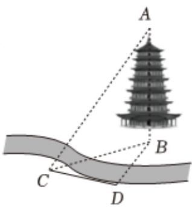

<!-- question-source:start -->
7、如图，为了测量河对岸的塔高AB，某测量队选取与塔底B在同一水平面内的两个测量基点C与D.现测量得 $\angle CDB=120^{\circ}$ ，CD=30米，在点C，D处测得塔顶A的仰角分别为 $30^{\circ}$ ， $45^{\circ}$ ，则塔高AB=（）

A 30米  
B $30\sqrt{2}$ 米  
C $30\sqrt{3}$ 米  
D $15\sqrt{2}$ 米
<!-- question-source:end -->

![[Q00090516A1]]
