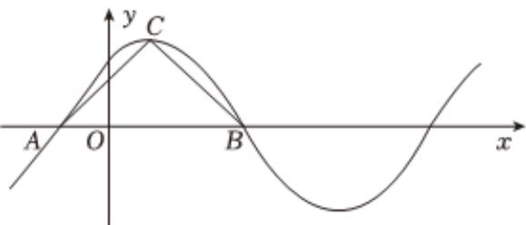

<!-- question-source:start -->
1、下列结论正确的是（）
A 若 $A(0,0)$ ， $B(2,3)$ ， $C(-4,-6)$ ，则 $A$ ， $B$ ， $C$ 三点共线
B 若 $A(0,0)$ ， $B(2,4)$ ，则线段AB的中点坐标为 $(1,2)$ C 对于向量 $\overrightarrow{a}$ ， $\overrightarrow{b}$ ，有 $|\overrightarrow{a} + \overrightarrow{b}| \geq |\overrightarrow{a} - \overrightarrow{b}|$ D 对于向量 $\overrightarrow{a}$ ， $\overrightarrow{b}$ ，有 $|\overrightarrow{a} + \overrightarrow{b}| \leq |\overrightarrow{a}| + |\overrightarrow{b}|$

<!-- question-source:end -->

![[Q00090518A1]]
