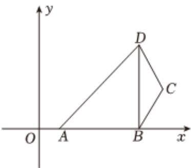

<!-- question-source:start -->
5、在平面直角坐标系 $xOy$ 中，已知点 $A(2,0)$ ， $B(10,0)$ ， $C(11,3)$ ， $D(10,6)$ .

(1)①证明： $\cos\angle ABC+\cos\angle ADC=0$ ；

②证明：存在点 $P$ 使得 $PA = PB = PC = PD$ . 并求出 $P$ 的坐标；

(2)过C点的直线l将四边形ABCD分成周长相等的两部分，产生的另一个交点为E，求点E的坐标.

<!-- question-source:end -->

![[Q00090528A1]]
