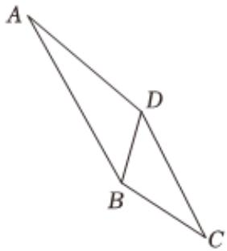

<!-- question-source:start -->
2、如图，在平面四边形ABCD中，BC=2， $\angle BCD=\frac{\pi}{6}$ ， $\triangle BCD$ 的面积为 $\frac{\sqrt{3}+1}{2}$ .
(1)求BD；

(2)若 $AD = 2\sqrt{2}$ , $\angle ABD = \frac{\pi}{4}$ , 求 $\sin \angle ADB$ .

<!-- question-source:end -->

![[Q00092202A1]]
