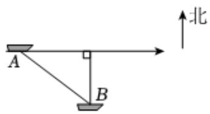

<!-- question-source:start -->
4、某时刻，船只甲在A处以每小时30海里的速度向正东方向行驶，与此同时，在A处南偏东53°方向距离甲150海里的B处，有一艘补给船同时出发，准备与甲会合.

(1)若要使得两船同时到达会合点时补给船行驶的路程最短，补给船应沿何种路线，以多大的速度行驶？

(2)要使补给船能追上甲，该补给船的速度最小为多少？当该补给船以最小速度行驶时，要多长时间追上甲？（参考数据：取 $\sin 53^{\circ} = 0.8, \cos 53^{\circ} = 0.6$ ）
<!-- question-source:end -->

![[Q00092203A1]]
