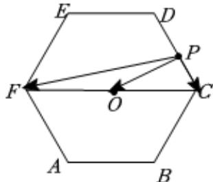

> [!faq]- 2023-2024学年内蒙古名校联盟高一（下）期中数学试卷解析
>
> > [!success]- **【答案】** B
>
> > [!note]- **【解析】**
> > 如图，
> >
> > 
> >
> > 设正六边形 $ABCDEF$ 的中心为O
> >
> > $$
> > \because \overrightarrow {P F} = \overrightarrow {P O} + \overrightarrow {O F}, \overrightarrow {P C} = \overrightarrow {P O} + \overrightarrow {O C},
> > $$
> >
> > $$
> > \therefore \overrightarrow {P F} \bullet \overrightarrow {P C} = (\overrightarrow {P O} + \overrightarrow {O F}) \bullet (\overrightarrow {P O} + \overrightarrow {O C}) = | \overrightarrow {P O} | ^ {2} + \overrightarrow {P O} \bullet (\overrightarrow {O F} + \overrightarrow {O C}) + \overrightarrow {O F} \bullet \overrightarrow {O C}
> > $$
> >
> > $$
> > = | \overrightarrow {P O} | ^ {2} - 4
> > $$
> >
> > $$
> > \because | \overrightarrow {P O} | \in [ \sqrt {3}, 2 ], \therefore | \overrightarrow {P O} | ^ {2} - 4 \in [ - 1, 0 ].
> > $$
> >
> > 故选：B.
