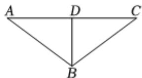

> [!faq]- 2023-2024学年内蒙古名校联盟高一（下）期中数学试卷解析
>
> > [!success]- **【答案】** 详见解析
>
> > [!note]- **【解析】**
> > 详见解析
> >
> > （1）假设甲行驶的路线为 $AC$ ，过 $B$ 作 $AC$ 的垂线 $BD$ ，点 $B$ 到 $AC$ 的最短距离为 $BD$ 要使补给船行驶的路程最短，补给船需沿正北方向，即 $BD$ 方向行驶， $AD = AB\cos \angle BAD = 120$ ， $BD = AB\sin \angle BAD = 90$ 甲行驶到 $D$ 处所需时间为 $\frac{120}{30} = 4$ 小时，补给船行驶的速度为 $\frac{90}{4} = 22.5$ 海里/小时，故要使得两船同时到达会合点时，补给船行驶的路程最短，补给船应沿正北方向，以22.5海里/小时的速度行驶.
> >
> > 
> >
> > (2)设补给船以v海里/小时的速度从B处出发，沿BC方向行驶，
> >
> > $t(t>0)$ 小时后与甲在C处会合.
> >
> > 在 $\triangle ABC$ 中， $AB=150$ ， $AC=30t$ ， $BC=vt$ .
> >
> > 由余弦定理得 $BC^2 = AC^2 + AB^2 - 2AB \cdot AC \cos \angle BAC$
> >
> > 所以 $v^{2}t^{2} = (30t)^{2} + 150^{2} - 2 \times 150 \times 30t \times 0.8$
> >
> > $$
> > v ^ {2} = \frac {2 2 5 0 0}{t ^ {2}} - \frac {7 2 0 0}{t} + 9 0 0 = 2 2 5 0 0 \left(\frac {1}{t} - \frac {4}{2 5}\right) ^ {2} + 3 2 4.
> > $$
> >
> > 当 $\frac{1}{t} = \frac{4}{25}$ ，即 $t = \frac{25}{4}$ 时， $v^2$ 取得最小值324，即 $v_{\mathrm{min}} = 18$
> >
> > 所以补给船至少以18海里/小时的速度行驶才能追上甲.
> >
> > 当补给船以最小速度行驶时，要6.25小时追上甲.
