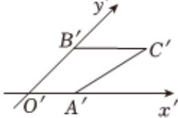

<!-- question-source:start -->
6、如图，四边形 $O^{\prime}A^{\prime}C^{\prime}B^{\prime}$ 表示水平放置的四边形OACB根据斜二测画法得到的直观图， $O^{\prime}A^{\prime}=2$ ， $B^{\prime}C^{\prime}=4$ ， $O^{\prime}B^{\prime}=2\sqrt{2}$ ， $O^{\prime}A^{\prime}//B^{\prime}C^{\prime}$ ，则AC=（）
A $2\sqrt{3}$ B 4
C 6
D $4\sqrt{2}$

<!-- question-source:end -->

![[Q00090534A1]]
