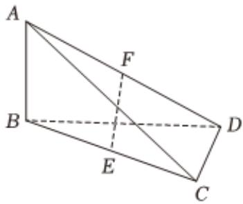

<!-- question-source:start -->
7、《九章算术》中，将四个面都为直角三角形的四面体称为鳖臑，在如图所示的鳖臑A-BCD中， $AB \perp$ 平面BCD， $BD \perp CD$ ，E，F分别为BC，AD的中点，过EF的截面 $\alpha$ 与AC交于点G，与BD交于点H，AB=1，若 $AB \parallel$ 截面 $\alpha$ ，且 $CD \parallel$ 截面 $\alpha$ ，四边形GEHF是正方形，则 $CD=(\quad)$ A $\frac{1}{2}$ B 1
C $\frac{3}{2}$ D 2

<!-- question-source:end -->

![[Q00090535A1]]
