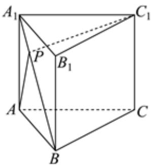

<!-- question-source:start -->
3、如图所示，在直三棱柱ABC- $A_{1}B_{1}C_{1}$ 中， $AC=2AA_{1}=2\sqrt{7}$ ， $AB=BC=\sqrt{21}$ ，P是线段 $A_{1}B$ 上一动点，则AP+PC $_{1}$ 的最小值为\_\_\_\_。

<!-- question-source:end -->

![[Q00090542A1]]
