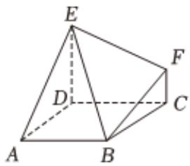

<!-- question-source:start -->
3、如图，在六面体 $ABCDEF$ 中， $DE \parallel CF$ ，正方形 $ABCD$ 的边长为2， $DE = 2FC = 2$ ， $AE = 2\sqrt{2}$ ， $BE = 2\sqrt{3}$ .

(1)证明：平面 $ADE \parallel$ 平面BCF.

(2)求直线EF与平面ABCD所成角的正切值.

(3)求多面体 $ABCDEF$ 的体积.

<!-- question-source:end -->

![[Q00090545A1]]
