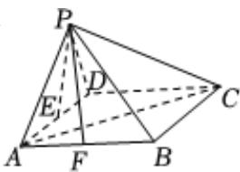

<!-- question-source:start -->
2、如图，在四棱锥P-ABCD中，底面ABCD是菱形， $\angle DAB=60^{\circ}$ ，E，F分别为AD，AB的中点，且AC⊥PE.

(1)证明： $AC \perp PF.$

(2)若 $PA = PD = AB = 2$ ，求点 $D$ 到平面 $PAF$ 的距离.

<!-- question-source:end -->

![[Q00092204A1]]
