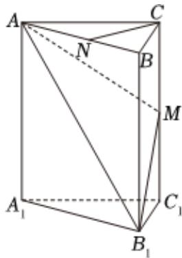

<!-- question-source:start -->
5、刻画空间的弯曲性是几何研究的重要内容，用曲率刻画空间的弯曲性，规定：多面体顶点的曲率等于 $2\pi$ 与多面体在该点的面角之和的差，其中多面体的面的内角叫做多面体的面角，角度用弧度制。例如：正四面体每个顶点均有3个面角，每个面角均为 $\frac{\pi}{3}$ ，故其各个顶点的曲率均为 $2\pi - 3 \times \frac{\pi}{3} = \pi$ 。如图，在直三棱柱

$ABC - A_{1}B_{1}C_{1}$ 中，点A的曲率为 $\frac{2\pi}{3}$ ，N，M分别为AB， $CC_{1}$ 的中点，且AB = AC.

(1)证明： $CN\bot$ 平面 $ABB_{1}A_{1}$

(2)证明：平面 $AMB_{1}\perp$ 平面 $ABB_{1}A_{1}$ .

(3)若 $AA_{1}=2AB$ ，求二面角 $A-MB_{1}-C_{1}$ 的正切值.

<!-- question-source:end -->

![[Q00092206A1]]
