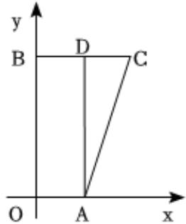

> [!faq]- 2023-2024学年内蒙古名校联盟高一（下）质检数学试卷解析
>
> > [!success]- **【答案】** C
>
> > [!note]- **【解析】**
> > 还原四边形OACB，如图所示，
> >
> > 
> >
> > 由斜二测画法的规则可得, $OA \perp OB, OA \parallel BC$ , $OA = 2$ , $BC = 4$ , $OB = 4\sqrt{2}$ ,
> >
> > 取 $BC$ 的中点 $\pmb{D}$ ，连接 $AD$
> >
> > 则 $AD \perp BC$ ，且AD = OB = $\sqrt{2}$ ，CD = 2，
> >
> > 由勾股定理可得， $AC = \sqrt{AD^2 + CD^2} = \sqrt{(4\sqrt{2})^2 + 2^2} = 6.$
> >
> > 故选：C.
