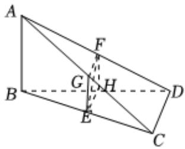

> [!faq]- 2023-2024学年内蒙古名校联盟高一（下）质检数学试卷解析
>
> > [!success]- **【答案】** B
>
> > [!note]- **【解析】**
> > 因为 $E$ ， $F$ 分别为 $BC$ ， $AD$ 的中点，过 $EF$ 的截面 $\alpha$ 与 $AC$ 交于点 $G$
> >
> > 与BD交于点H, AB//截面α，且CD//截面α，四边形GEHF是正方形，可得G，H分别为AC，BD的中点，
> >
> > $$
> > A B \parallel G E, G F \parallel C D, A B = 2 G E, C D = 2 G F
> > $$
> >
> > 因为四边形GEHF是正方形，
> >
> > 所以GE = GF，
> >
> > 
> >
> > 因为AB=1，
> >
> > 所以 $CD = AB = 1$ .
> >
> > 故选：B.
