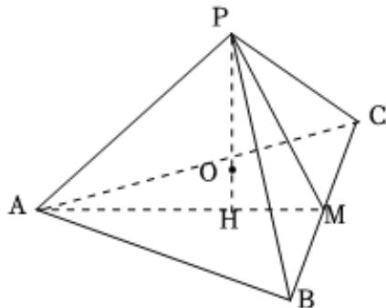

> [!faq]- 2023-2024学年内蒙古名校联盟高一（下）质检数学试卷解析
>
> > [!success]- **【答案】** ACD
>
> > [!note]- **【解析】**
> > 如图，取BC的中点M，连接AM，PM，作PH⊥平面ABC，易证H在AM上，且AH=2HM=2 $\sqrt{3}$ ，
> >
> > 则 $PH=\sqrt{6^{2}-(2\sqrt{3})^{2}}=2\sqrt{6}$ ,
> >
> > 从而三棱锥 $P - ABC$ 的体积 $V = \frac{1}{3} Sh = \frac{1}{3} \times \frac{\sqrt{3}}{4} \times 6^2 \times 2\sqrt{6} = 18\sqrt{2}$ ，故 $A$ 正确；
> >
> > 设三棱锥 $P - ABC$ 内切球的半径为 $\pmb{r}$ ，则 $V_{P - ABC} = \frac{1}{3} S_{P - ABC}\bullet r$
> >
> > 所以 $r=\frac{3V_{P-ABC}}{S_{P-ABC}}=\frac{3\times18\sqrt{2}}{9\sqrt{3}\times4}=\frac{\sqrt{6}}{2}$ ，故B错误；
> >
> > 设三棱锥 $P - ABC$ 外接球的半径为 $\pmb{R}$ ，球心为 $O$ ，
> >
> > 则 $R^2 = AH^2 + OH^2 = (PH - OH)$
> >
> > 即 $R^2 = 12 + OH^2 = (2\sqrt{6} - OH)^2$
> >
> > 解得 $OH = \frac{\sqrt{6}}{2}$ ，所以 $R = \frac{3\sqrt{6}}{2}$
> >
> > 则三棱锥 $P - ABC$ 外接球的体积是 $27\sqrt{6}\pi$
> >
> > 显然 $DE$ 长度的取值范围是 $[\sqrt{6}, 2\sqrt{6}]$ ，故 $C, D$ 正确.
> >
> > 故选：ACD.
> >
> > 
