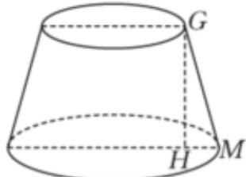

> [!faq]- 2023-2024学年内蒙古名校联盟高一（下）质检数学试卷解析
>
> > [!success]- **【答案】** $5\sqrt{35}$
>
> > [!note]- **【解析】**
> > 如图，
> >
> > 
> >
> > 作 $GH \perp HM$ . 设简易笔筒的上、下底面圆的半径分别为 $r_1, r_2, \frac{\pi}{3} \times 30 = 2\pi r_1$ ，解得 $r_1 = 5, \frac{\pi}{3} \times 60 = 2\pi r_2$ ，解得 $r_2 = 10$ ，
> >
> > 所以 $HM = r_2 - r_1 = 5$ ， $HG = \sqrt{GM^2 - HM^2} = 5\sqrt{35}.$
> >
> > 故答案为： $5\sqrt{35}$ .
