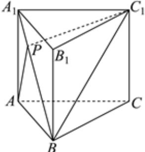
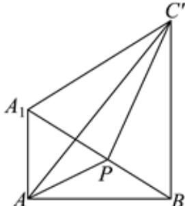

> [!faq]- 2023-2024学年内蒙古名校联盟高一（下）质检数学试卷解析
>
> > [!success]- **【答案】** 7
>
> > [!note]- **【解析】**
> > 连接 $BC_{1}$ ，以 $A_{1}B$ 所在直线为旋转轴，将 $\triangle A_{1}BC_{1}$ 所在平面旋转到与平面 $ABB_{1}A_{1}$ 重合，
> >
> > 
> >
> > 设点 $C_{1}$ 的新位置为 $C'$ ，连接 $AC'$ ，则有 $AP + PC_{1} = AP + PC' \geqslant AC'$ ，如图所示.
> >
> > 
> >
> > 当 $A, P, C'$ 三点共线时， $AC'$ 的长为 $AP + PC_1$ 的最小值，
> >
> > 因为 $AA_{1}=\sqrt{7},AB=\sqrt{21}$
> >
> > 所以 $A_{1}B=BC'=\sqrt{\left(\sqrt{7}\right)^{2}+\left(\sqrt{21}\right)^{2}}=2\sqrt{7}$
> >
> > 又 $A_{1}C^{\prime} = 2\sqrt{7}$ ，所以 $\triangle A_1BC'$ 是边长为 $2\sqrt{7}$ 的正三角形， $\angle A_1BC' = \frac{\pi}{3}$
> >
> > 又 $tan\angle ABA_{1}=\frac{\sqrt{3}}{3}$
> >
> > 所以 $\angle ABA_{1} = \frac{\pi}{6}$ ，所以 $\angle ABC' = \frac{\pi}{2}$
> >
> > 由勾股定理得 $AC'=\sqrt{21+28}=7.$
> >
> > 故答案为：7.
