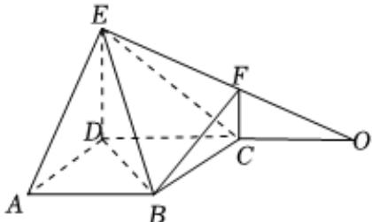

> [!faq]- 2023-2024学年内蒙古名校联盟高一（下）质检数学试卷解析
>
> > [!success]- **【答案】** 详见解析
>
> > [!note]- **【解析】**
> > 详见解析
> >
> > (1) 证明：∵ $DE \parallel CF$ ， $DE \subset$ 平面 $ADE$ ， $CF \notin$ 平面 $ADE$ ，
> >
> > ∴CF//平面ADE
> >
> > 在正方形ABCD中, $AD \parallel BC$ ，又∵AD⊂平面ADE，
> >
> > $BC \notin$ 平面ADE, $\therefore BC \parallel$ 平面ADE,
> >
> > $\because CF \cap BC = C, CF \subset \text{平面} BCF, BC \subset \text{平面} BCF,$
> >
> > ∴平面ADE//平面BCF.
> >
> > 
> >
> > (2)连接BD，延长EF，DC交于点O，
> >
> > $\because$ 正方形 $ABCD$ 的边长为2， $DE = 2FC = 2$ ， $AE = 2\sqrt{2}$ ， $BE = 2\sqrt{3}$
> >
> > $$
> > \therefore A D ^ {2} + D E ^ {2} = A E ^ {2}, \therefore A D \bot D E
> > $$
> >
> > $$
> > \because B D = \sqrt {A B ^ {2} + A D ^ {2}} = 2 \sqrt {2}, \therefore B D ^ {2} + D E ^ {2} = B E ^ {2}, \therefore B D \perp D E
> > $$
> >
> > $$
> > \because A D \cap B D = D, \therefore D E \perp \text {平面} A B C D
> > $$
> >
> > $\therefore \angle DOE$ 为直线 $EF$ 与平面ABCD所成的角，
> >
> > 在 $\triangle ODE$ 中，由 $\frac{CO}{DO} = \frac{CF}{DE}$ ，解得 $DO = 4$ ， $\tan \angle DOE = \frac{DE}{DO} = \frac{1}{2}$
> >
> > 即直线EF与平面ABCD所成角的正切值为 $\frac{1}{2}$ .
> >
> > (3)连接 $EC$ ，则 $V_{E - ABCD} = \frac{1}{3}\times 2\times 2\times 2 = \frac{8}{3}$
> >
> > 易证 $CD \perp$ 平面BCF， $V_{E-BCF}=\frac{1}{3}S_{\triangle BCF}\bullet DC=\frac{1}{3}\times\frac{1}{2}\times2\times1\times2=\frac{2}{3}$
> >
> > $\therefore$ 多面体 $ABCDEF$ 的体积 $V = V_{E - ABCD} + V_{E - BCF} = \frac{10}{3}$
