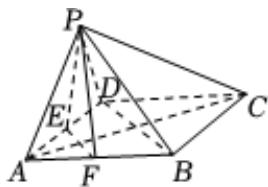

> [!faq]- 2023-2024学年内蒙古名校联盟高一（下）质检数学试卷解析
>
> > [!success]- **【答案】** 详见解析
>
> > [!note]- **【解析】**
> > 详见解析
> >
> > (1)证明：连接BD，EF，
> >
> > 因为底面ABCD是菱形，所以AC⊥BD，
> >
> > 因为E，F分别为AD，AB的中点，所以EF//BD，
> >
> > 所以 $AC \perp EF$ ，
> >
> > 又 $AC \perp PE, EF \cap PE = E, EF, PE \subset$ 平面 $PEF$ ,
> >
> > 所以 $AC \perp$ 平面PEF，
> >
> > 因为 $PF \subset$ 平面PEF，所以 $AC \perp PF$ .
> >
> > (2)因为 $PA = PD$ ， $E$ 是 $AD$ 的中点，所以 $PE \perp AD$ ，
> >
> > 又 $AC \perp PE, AD \cap AC = A, AD, AC \subset$ 平面ABCD，
> >
> > 所以 $PE \perp$ 平面ABCD，
> >
> > 即点P到平面ADF的距离为PE= $\sqrt{3}$ ,
> >
> > 因为 $EF \subset$ 平面ABCD，所以 $PE \perp EF$ ，所以
> >
> > 
> >
> > $$
> > P F = \sqrt {P E ^ {2} + E F ^ {2}} = \sqrt {(\sqrt {3}) ^ {2} + 1 ^ {2}} = 2 = P A
> > $$
> >
> > $$
> > S _ {\triangle P A F} = \frac {1}{2} A F \cdot \sqrt {P A ^ {2} - (\frac {1}{2} A F) ^ {2}} = \frac {1}{2} \times 1 \times \sqrt {2 ^ {2} - (\frac {1}{2}) ^ {2}} = \frac {\sqrt {1 5}}{4}
> > $$
> >
> > $$
> > S _ {\triangle A D F} = \frac {1}{2} A D \cdot A F \sin 6 0 ^ {\circ} = \frac {1}{2} \times 2 \times 1 \times \frac {\sqrt {3}}{2} = \frac {\sqrt {3}}{2}
> > $$
> >
> > 设点D到平面PAF的距离为d，
> >
> > 因为 $V_{D - PAF} = V_{P - ADF}$
> >
> > 所以 $\frac{1}{3} d\cdot S_{\triangle PAF} = \frac{1}{3} PE\cdot S_{\triangle ADF}$ ，即 $d\cdot \frac{\sqrt{15}}{4} = \sqrt{3}\cdot \frac{\sqrt{3}}{2}$ ，解得 $d = \frac{2\sqrt{15}}{5}$
> >
> > 故点D到平面PAF的距离为 $\frac{2\sqrt{15}}{5}$ .
