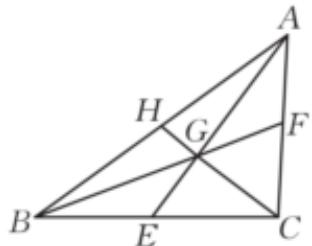

> [!faq]- 2023-2024学年内蒙古名校联盟高一（下）质检数学试卷解析
>
> > [!success]- **【答案】** 详见解析
>
> > [!note]- **【解析】**
> > 详见解析
> >
> > (1)证明：设BC的中点为E，则 $\overrightarrow{GB}+\overrightarrow{GC}=2\overrightarrow{GE}$
> >
> > 因为 $\overrightarrow{GA} +\overrightarrow{GB} +\overrightarrow{GC} = \overrightarrow{0}$ ，所以 $\overrightarrow{GA} +2\overrightarrow{GE} = \overrightarrow{0}$ ，可得 $\overrightarrow{GA} = -2\overrightarrow{GE}$
> >
> > 由此可得A、G、E三点共线，即点G在△ABC的中线AE上.
> >
> > 设 $AC$ 的中点为 $F$ , $AB$ 的中点为 $H$ , 同理可证点 $G$ 在 $\triangle ABC$ 的中线 $BF$ 、 $CH$ 上, 所以点 $G$ 为 $\triangle ABC$ 三条中线的交点, 即 $G$ 为 $\triangle ABC$ 的重心.
> >
> > 
> >
> > (2)①证明：由（1）知 $\overrightarrow{GA} = -2\overrightarrow{GE}$ ，因为 $AG = 4$ ，所以 $EG = 2$ .
> >
> > 因为 $BC = 6$ ，所以 $BE = CE = 3$
> >
> > 设 $\angle CEG = \alpha$ ，则 $\angle BEG = \pi -\alpha$ ， $\cos \angle BEG = -\cos \alpha$
> >
> > 由余弦定理，得 $CG^{2}=2^{2}+3^{2}-2\times2\times3\cos\alpha$ ， $BG^{2}=2^{2}+3^{2}+2\times2\times3\cos\alpha$
> >
> > 则 $BG^{2}+CG^{2}=2(2^{2}+3^{2})=26.$
> >
> > ②设 $BG=\sqrt{26}\cos\theta$ ， $CG=\sqrt{26}\sin\theta$ ， $\theta\in(0,\frac{\pi}{2})$ ，
> >
> > $$
> > B G + \sqrt {3} C G = \sqrt {2 6} (\cos \theta + \sqrt {3} \sin \theta) = 2 \sqrt {2 6} \sin \left(\theta + \frac {\pi}{6}\right)
> > $$
> >
> > 当 $\theta +\frac{\pi}{6} = \frac{\pi}{2}$ ，即 $\theta = \frac{\pi}{3}$ 时， $BG + \sqrt{3} CG$ 取得最大值，且最大值为 $2\sqrt{26}$
> >
> > 此时 $BG=\sqrt{26}\cos\frac{\pi}{3}=\sqrt{13+12\cos\alpha}$ ，解得 $\cos\alpha=-\frac{13}{24}$ ，
> >
> > $$
> > A B = \sqrt {B E ^ {2} + A E ^ {2} - 2 B E \bullet A E c o s \angle B E G} = \sqrt {3 ^ {2} + 6 ^ {2} - 3 6 \times \frac {1 3}{2 4}} = \sqrt {\frac {5 1}{2}} = \frac {\sqrt {1 0 2}}{2}
> > $$
