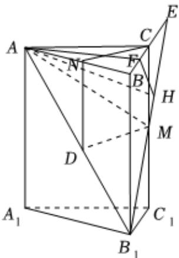

> [!faq]- 2023-2024学年内蒙古名校联盟高一（下）质检数学试卷解析
>
> > [!success]- **【答案】** 详见解析
>
> > [!note]- **【解析】**
> > 详见解析
> >
> > (1)证明：在直三棱柱 $ABC-A_{1}B_{1}C_{1}$ 中， $AA_{1}\perp$ 平面ABC，AC， $AB\subset$ 平面ABC，
> >
> > 则 $AA_{1}\perp AC$ ， $AA_{1}\perp AB$ ，所以点A的曲率为 $2\pi-2\times\frac{\pi}{2}-\angle BAC=\frac{2\pi}{3}$
> >
> > 所以 $\angle BAC = \frac{\pi}{3}$ ，因为 $AB = AC$ ，所以 $\triangle ABC$ 为正三角形，
> >
> > 因为N为AB的中点，所以CN⊥AB，
> >
> > 又 $AA_{1}\perp$ 平面ABC，CN⊂平面ABC，所以 $AA_{1}\perp CN$ ，
> >
> > $$
> > A A _ {1} \cap A B = A, A A _ {1} 、 A B \subset \text {平面} A B B _ {1} A _ {1}
> > $$
> >
> > 所以 $CN \perp$ 平面 $ABB_{1}A_{1}$
> >
> > (2)证明：取 $AB_{1}$ 的中点D，连接DM，DN，
> >
> > 因为N为AB的中点，所以 $DN \parallel BB_{1}$ 且DN= $\frac{1}{2}BB_{1}$ ，
> >
> > 
> >
> > 又 $CM \parallel BB_{1}$ 且CM = $\frac{1}{2}BB_{1}$ ，所以DN ∥ CM 且DN = CM，
> >
> > 所以四边形CNDM为平行四边形，则DM//CN，
> >
> > 由（1）知 $CN \perp$ 平面 $ABB_{1}A_{1}$ ，则 $DM \perp$ 平面 $ABB_{1}A_{1}$
> >
> > 又DM⊂平面 $AMB_{1}$ ，所以平面 $AMB_{1}\perp$ 平面 $ABB_{1}A_{1}$ .
> >
> > (3)取BC的中点F，连接AF，则 $AF\perp BC$ ，
> >
> > 因为 $BB_{1}\perp$ 平面ABC，AF⊂平面ABC，所以 $BB_{1}\perp AF$
> >
> > $$
> > B B _ {1} \cap B C = B, B B _ {1} 、 B C \subset \text {平面} B B _ {1} C _ {1} C
> > $$
> >
> > 所以 $AF \perp$ 平面 $BB_{1}C_{1}C$ ，又 $B_{1}M \subset$ 平面 $BB_{1}C_{1}C$ ，所以 $AF \perp B_{1}M$
> >
> > 过 $F$ 作 $B_{1}M$ 的垂线，垂足为 $H$ ，连接 $AH$ ，则 $B_{1}M \perp FH$
> >
> > 又 $AF \cap FH = F$ ，AF、FH ⊂ 平面 AFH，所以 $B_{1}M \perp$ 平面 AFH，
> >
> > $AH\subset$ 平面 $AFH$ ， $AH\bot B_1M$
> >
> > 所以 $\angle AHF$ 为二面角 $A - MB_{1} - C_{1}$ 的平面角的补角，
> >
> > 设 $B_{1}M\cap BC = E$ ， $AB = 2$ ，则 $AF = \sqrt{3}$ ， $EF = 1 + 2 = 3$ ， $ME = 2\sqrt{2}$
> >
> > 由等面积法可得 $\frac{1}{2} ME\bullet FH = \frac{1}{2} EF\bullet CM$ ，则 $FH = \frac{EF\bullet CM}{ME} = \frac{3\times 2}{2\sqrt{2}} = \frac{3}{\sqrt{2}}$
> >
> > 则 $tan\angle AHF=\frac{AF}{FH}=\frac{\sqrt{6}}{3}$ ，故二面角 $A-MB_{1}-C_{1}$ 的正切值为 $-\frac{\sqrt{6}}{3}$ .
