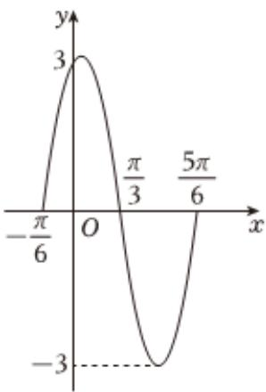

<!-- question-source:start -->
4、

已知函数 $f(x) = A \sin(\omega x + \varphi) (A > 0, \omega > 0, |\varphi| < \frac{\pi}{2})$ 的图象的一部分如图所示.

1 求函数 $f(x)$ 的解析式和单调递增区间；

若将函数 $f(x)$ 图象上所有点的横坐标变为原来的2倍（纵坐标不变），再向右平移 $\frac{\pi}{3}$ 个单位长度，再将函数图象上所有点的纵坐标变为原来的 $\frac{1}{3}$ 倍（横坐标不变），得到函数 $g(x)$ 的图象，求函数 $h(x)=\left(\sin x+\cos x\right)\cdot g(x)$ 在 $[0,\frac{\pi}{2}]$ 上的最大值.
<!-- question-source:end -->

![[Q00090589A1]]
