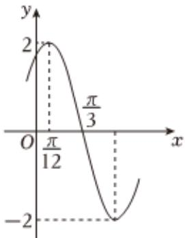

<!-- question-source:start -->
3、已知函数 $f(x) = A \sin(\omega x + \varphi) (A > 0, \omega > 0, |\varphi| < \frac{\pi}{2})$ 的部分图像如图所示，下列说法正确的是（）

A $f(x)$ 的图像关于点 $(- \frac{\pi}{3}, 0)$ 对称  
B $f(x)$ 的图像关于直线 $x = -\frac{5\pi}{12}$ 对称  
C 将函数 $y = 2\cos 2x$ 的图像向右平移 $\frac{\pi}{12}$ 个单位长度得到函数 $f(x)$ 的图像  
D 若方程 $f(x) = m$ 在 $[- \frac{\pi}{2}, 0]$ 上有两个不相等的实数根，则 $m$ 的取值范围是 $(-2, -\sqrt{3}]$
<!-- question-source:end -->

![[Q00091711A1]]
