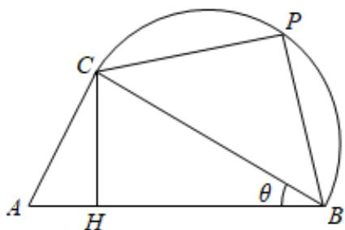

<!-- question-source:start -->
5、设函数 $f(x)=\sin(2x-\frac{\pi}{6})-2\sin^{2}x+1(x\in R)$ .

1 若 $f(\alpha) = \frac{1}{2}$ , $\alpha \in [0, \frac{\pi}{2}]$ , 求角 $\alpha$ ;

2 若不等式 $[f(x)]^2 + 2a\cos (2x + \frac{\pi}{6}) - 2a - 2 < 0$ 对任意 $x \in (-\frac{\pi}{12}, \frac{\pi}{6})$ 时恒成立，求实数 $a$ 的取值范围.

某公司欲生产一款迎春工艺品回馈消费者，工艺品的平面设计如图所示，该工艺品由直角 $\triangle ABC$ 和以 $BC$ 为直径的半圆拼接而成，点 $P$ 为半圆上一点（异于 $BC$ ），点 $H$ 在线段 $AB$ 上，且满足 $CH \perp AB$ . 已知 $\angle ACB = 90^{\circ}$ ， $AB = 1dm$ ，设 $\angle ABC = \theta$ .

为了使工艺礼品达到最佳观赏效果，需满足 $\angle ABC = \angle PCB$ ，且 $CA + CP$ 达到最大.当 $\theta$ 为何值时，工艺礼品达到最佳观赏效果，并求最大值；

为了工艺礼品达到最佳稳定性便于收藏，需满足 $\angle PBA = 60^{\circ}$ ，且 $CH + CP$ 达到最大。当 $\theta$ 为何值时， $CH + CP$ 取得最大值，并求该最大值。
<!-- question-source:end -->

![[Q00091721A1]]
