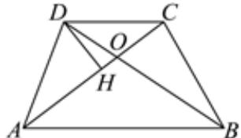

> [!faq]- 2023-2024学年内蒙古师大附属二中高一（下）期中数学试卷解析
>
> > [!success]- **【答案】** D
>
> > [!note]- **【解析】**
> > 设 $AC$ 与 $BD$ 交于点 $O$ ， $\because \overrightarrow{AB} = 2\overrightarrow{DC},\therefore \overrightarrow{DB} = 3\overrightarrow{DO}.$
> >
> > 
> >
> > 又 $DH\perp AC$ 于点H，且DH=2，
> >
> > $\therefore \overrightarrow{DH} \cdot \overrightarrow{DO} = |\overrightarrow{DH}| |\overrightarrow{DO}| \cos \angle BDH = \overrightarrow{DH}^2 = 4,$ $\therefore \overrightarrow{DH} \cdot \overrightarrow{DB} = \overrightarrow{DH} \cdot 3\overrightarrow{DO} = 3 \times 4 = 12.$
> >
> > 故选：D.
