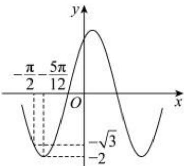

> [!faq]- 2023-2024学年内蒙古师大附属二中高一（下）期中数学试卷解析
>
> > [!success]- **【答案】** BCD
>
> > [!note]- **【解析】**
> > 由图可知： $A = 2$ ， $f(x)$ 的周期 $T = 4\times \left(\frac{\pi}{3} -\frac{\pi}{12}\right) = \pi ,\omega = \frac{2\pi}{T} = 2$
> >
> > $x = \frac{\pi}{12}$ 时， $\omega x + \varphi = \frac{\pi}{2} +2k\pi ,(k\in Z),2x + \varphi = \frac{\pi}{2} +2k\pi ,$
> >
> > $$
> > | \varphi | <   \frac {\pi}{2}, \therefore \varphi = \frac {\pi}{3}, f (x) = 2 \sin \left(2 x + \frac {\pi}{3}\right).
> > $$
> >
> > 对于 $A$ ， $f(-\frac{\pi}{3}) = 2sin(-\frac{2\pi}{3} +\frac{\pi}{3}) = -\sqrt{3}\neq 0$ ，错误；
> >
> > 对于 $B$ ， $f(-\frac{5\pi}{12}) = 2sin(-\frac{5\pi}{6} +\frac{\pi}{3}) = -2$ ，正确；
> >
> > 对于 $C$ ，将 $\pmb {y} = 2\cos 2x$ 向右平移 $\frac{\pi}{12}$ 个单位，
> >
> > 得
> >
> > $$
> > \begin{array}{l} {y = 2 c o s [ 2 (x - \frac {\pi}{1 2}) ] = 2 c o s (2 x - \frac {\pi}{6}) = 2 c o s (2 x - \frac {\pi}{2} + \frac {\pi}{3})} \\ {= 2 c o s [ - (\frac {\pi}{2} - (2 x + \frac {\pi}{3}) ] = 2 s i n (2 x + \frac {\pi}{3})} \end{array}
> > $$
> >
> > ，正确；
> >
> > 对于 $D$ ， $\pmb {f}(\pmb {x})$ 的大致图像如下：
> >
> > 
> >
> > 欲使得在 $[- \frac{\pi}{2}, 0]$ 内方程 $f(x) = m$ 有2个不相等的实数根，则 $-2 < m \leqslant -\sqrt{3}$ ，正确；故选：BCD.
