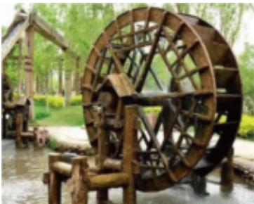

<!-- question-source:start -->
2、筒车是我国古代发明的一种水利灌溉工具。因其经济又环保，至今还在农业生产中使用（如图）。假设在水流稳定的情况下，筒车上的每一个盛水筒都做匀速圆周运动。现有一半径为2米的筒车，在匀速转动过程中，筒车上一盛水筒M距离水面的高度H(单位：米)与转动时间t(单位：秒)满足函数关系式 $H = 2\sin(\frac{\pi}{60}t + \varphi) + \frac{5}{4}, \varphi \in (\frac{\pi}{2}, \pi)$ ，且t = 0时，盛水筒M与水面距离为2.25米，当筒车转动20秒后，盛水筒M与水面距离为\_\_\_\_米。

<!-- question-source:end -->

![[Q00090561A1]]
