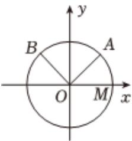

<!-- question-source:start -->
4、

如图，已知单位圆O与x轴正半轴交于点M，点A，B在单位圆上，其中点A在第一象限，且 $\angle AOB=\frac{\pi}{2}$ ，记 $\angle MOA=\alpha$ ， $\angle MOB=\beta$ .

1 若 $\alpha = \frac{\pi}{3}$ ，求点 $A$ 的坐标；

2 若点 $A$ 的坐标为 $\left(\frac{4}{5}, m\right)$ ，求 $\sin \alpha - \sin \beta$ 的值.
<!-- question-source:end -->

![[Q00090567A1]]
