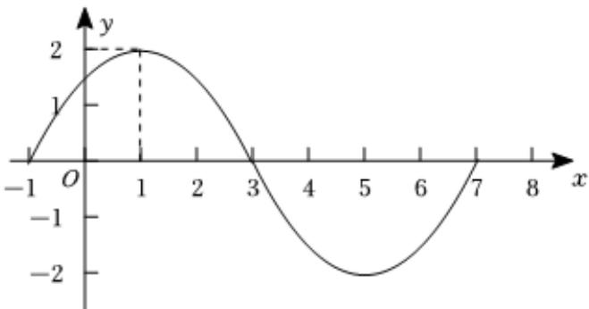

<!-- question-source:start -->
5、

已知函数

$f(x) = A\sin (\omega x + \varphi)(A > 0, \omega > 0, |\varphi| < \frac{\pi}{2}, x \in R)$

的图象的一部分如图所示：

1 求函数 $f(x)$ 的解析式；

2 若函数 $y = f(x)$ 的图象与直线 $y = m$ 没有公共点，求实数 $m$ 的取值范围.
<!-- question-source:end -->

![[Q00090568A1]]
