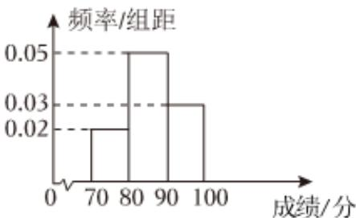

<!-- question-source:start -->
4、某校为了了解学生的体能情况，于6月中旬在全校进行体能测试，统计得到所有学生的体能测试成绩均在[70, 100]内.现将所有学生的体能测试成绩按[70, 80)，[80, 90)，[90, 100]分成三组，绘制成如图所示的频率分布直方图.若根据体能测试成绩采用按比例分层随机抽样的方法抽取20名学生作为某项活动的志愿者，则体能测试成绩在[90, 100]内的被抽取的学生人数为（）
A 4
B 6
C 8
D 10

<!-- question-source:end -->

![[Q00090595A1]]
