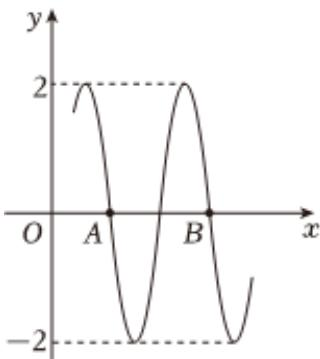

<!-- question-source:start -->
2、已知函数 $f(x) = A \sin (\omega x + \varphi) (A > 0, \omega > 0, |\varphi| < \frac{\pi}{2})$ 的部分图象如图所示，其中 $A\left(\frac{7\pi}{24}, 0\right), B\left(\frac{19\pi}{24}, 0\right)$ ，则（）

A $\omega = 4$

B $\varphi = -\frac{\pi}{3}$

C $f(x)$ 在 $[- \frac{3\pi}{8}, -\frac{\pi}{12}]$ 上单调递减

D 将 $f(x)$ 的图象向左平移 $\frac{\pi}{24}$ 个单位长度，得到的新函数图象关于原点对称
<!-- question-source:end -->

![[Q00090601A1]]
