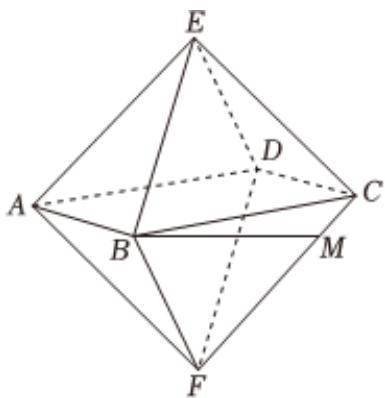

<!-- question-source:start -->
3、正八面体是一种正多面体，也是一种正轴体，由8个正三角形面组成，每个面均为正三角形.如图，正八面体EABCDF的棱长为10，M为棱FC上一点，且CM=2，则（）

A 平面EDC//平面FBA

B 该正八面体外接球的表面积为 $100\pi$

C 二面角 $E - AD - F$ 的余弦值为 $-\frac{1}{3}$

D 异面直线 $AE$ 与 $BM$ 所成角的余弦值为 $\frac{\sqrt{21}}{14}$
<!-- question-source:end -->

![[Q00090602A1]]
