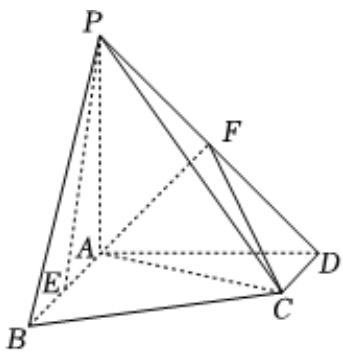

<!-- question-source:start -->
3、如图，在四棱锥 $P - ABCD$ 中， $PA \perp$ 平面

ABCD, PA = AD = 6, AB = 2CD = 6, AB // CD, AB ⊥ AD, F 为

PD的中点，E为AB的中点.

(1)证明： $PE / /$ 平面ACF.

(2)证明： $AF \perp$ 平面PCD.

(3)求直线AC与平面PCD所成角的正弦值.

<!-- question-source:end -->

![[Q00090608A1]]
