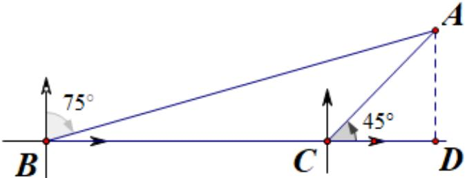

> [!faq]- 2023-2024学年内蒙古部分名校高一（下）期末数学试卷解析
>
> > [!success]- **【答案】** D
>
> > [!note]- **【解析】**
> > 设该船的初始位置为 $B$ ，2小时后的位置为 $C$ ，过 $A$ 作 $AD \perp BC$ ，垂足为 $D$
> >
> >   
> > 则 $AD$ 为所求的最短距离.
> >
> > 由题意可知 $\angle ABC = 15^{\circ}$ ， $\angle ACB = 135^{\circ}$ ， $BC = 60$ 海里，则 $\angle BAC = 30^{\circ}$
> >
> > 在 $\triangle ABC$ 中，由正弦定理可得 $\frac{AB}{\sin\angle ACB} = \frac{BC}{\sin\angle BAC}$
> >
> > 则 $AB = \frac{BC\sin\angle ACB}{\sin\angle BAC} = 60\sqrt{2}$ 海里.
> >
> > 在 $Rt\triangle ABD$ 中， $\angle ABD = 15^{\circ}$ ， $\angle ADB = 90^{\circ}$ ， $AB = 60\sqrt{2}$ 海里，
> >
> > $$
> > \sin 1 5 ^ {\circ} = \sin (4 5 ^ {\circ} - 3 0 ^ {\circ}) = \sin 4 5 ^ {\circ} \cos 3 0 ^ {\circ} - \cos 4 5 ^ {\circ} \sin 3 0 ^ {\circ} = \frac {\sqrt {6} - \sqrt {2}}{4}
> > $$
> >
> > $$
> > A D = A B \sin 1 5 ^ {\circ} = 6 0 \sqrt {2} \times \frac {\sqrt {6} - \sqrt {2}}{4}
> > $$
> >
> > 所以 $AD = 30(\sqrt{3} - 1)$ 海里.
> >
> > 故选：D.
