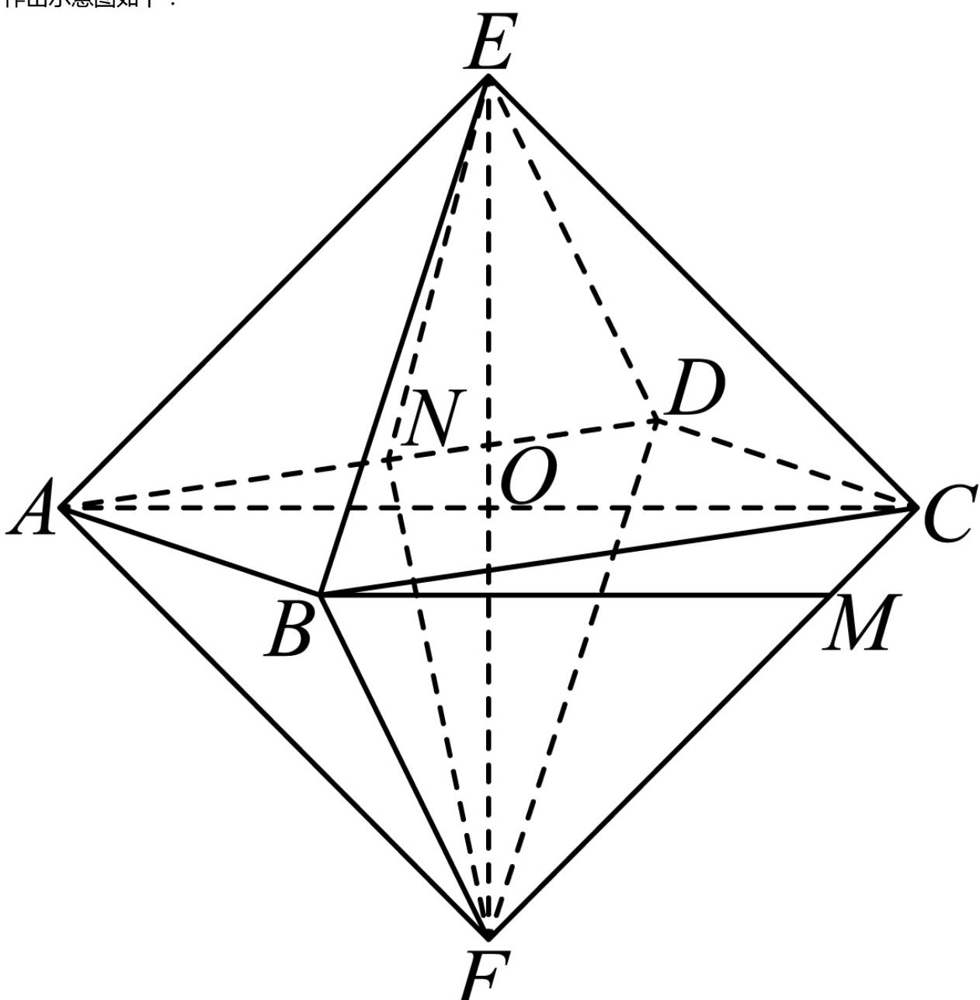

> [!faq]- 2023-2024学年内蒙古部分名校高一（下）期末数学试卷解析
>
> > [!success]- **【答案】** ACD
>
> > [!note]- **【解析】**
> > 作出示意图如下：
> >
> > 
> >
> > 根据题意可得 $ED \parallel BF$ ， $BF \subset$ 平面 $FBA$ ， $ED \nmid$ 平面 $FBA$ ，所以 $ED \parallel$ 平面 $FBA$ ，
> >
> > 又 $DC \parallel AB$ , 同理可得 $DC \parallel$ 平面 $FBA$ , 又 $ED \cap DC = D$ ,
> >
> > 所以平面EDC//平面FBA，所以A选项正确；
> >
> > 设 $EF$ 与 $AC$ 交于点 $O$ ，则 $AO$ 即该正八面体外接球的半径
> >
> > 因为 $AO = \frac{\sqrt{100 + 100}}{2} = 5\sqrt{2}$
> >
> > 所以该正八面体外接球的表面积为 $4\pi \times (5\sqrt{2})^2 = 200\pi$ ，所以 $B$ 选项错误；
> >
> > 取AD的中点N，易得 $EN\perp AD$ ， $FN\perp AD$ ，
> >
> > 所以二面角 $E - AD - F$ 的平面角为 $\angle ENF$
> >
> > 因为正八面体EABCDF的棱长为10，
> >
> > 所以 $EN=5\sqrt{3}$ ， $FN=5\sqrt{3}$ ， $EF=10\sqrt{2}$ ，
> >
> > 所以根据余弦定理可得 $\cos\angle ENF=\frac{(5\sqrt{3})^{2}+(5\sqrt{3})^{2}-(10\sqrt{2})^{2}}{2\times5\sqrt{3}\times5\sqrt{3}}=-\frac{1}{3}$ ，所以C正确.
> >
> > 因为 $FC \parallel AE$ ，所以 $\angle BMF$ 即异面直线 $AE$ 与 $BM$ 所成的角，
> >
> > 因为CM=2，所以FM=8.又 $\angle BFM=\frac{\pi}{3}$ ，
> >
> > 所以BM= $\sqrt{100+64-2\times10\times8\times\cos\frac{\pi}{3}}=2\sqrt{21}$
> >
> > 所以 $\cos\angle BNF=\frac{(2\sqrt{21})^{2}+8^{2}-10^{2}}{2\times2\sqrt{21}\times8}=\frac{\sqrt{21}}{14}$ ，所以D选项正确.
> >
> > 故选：ACD.
