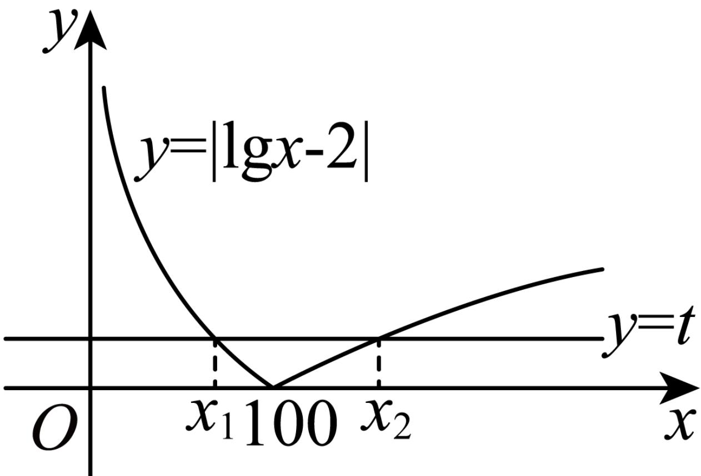

> [!faq]- 2023-2024学年内蒙古部分名校高一（下）期末数学试卷解析
>
> > [!success]- **【答案】** 100，20
>
> > [!note]- **【解析】**
> > 当 $t = 0$ 时，由 $\left|\lg x - 2\right| = 0$ ，解得 $x = 100$ ，得 $f(x)$ 的零点为100；
> >
> > 由题意得关于x的方程 $\left|\lg x-2\right|=t$ 有两个解 $x_{1}$ ， $x_{2}(x_{1}<x_{2})$ ，
> >
> > 作出 $y=|\lg x-2|$ 的图象，如图所示：
> >
> > 
> >
> > 则 $2 - \lg x_{1} = t = \lg x_{2} - 2$ ，且 $0 <   x_{1} <   100 <   x_{2}$
> >
> > 则 $\lg x_{1} + \lg x_{2} = 4$ ， $\lg x_{1}x_{2} = 4$
> >
> > 即 $x_{1}x_{2}=10^{4}=10000$ ，
> >
> > 所以 $x_{2}=\frac{10000}{x_{1}}$ ，
> >
> > 所以 $x_{1}+\frac{1}{100}x_{2}=x_{1}+\frac{100}{x_{1}}\geq2\sqrt{x_{1}\bullet\frac{100}{x_{1}}}=20$ ，当且仅当 $x_{1}=\frac{100}{x_{1}}$ ，即 $x_{1}=10$ 时，等号成立.
> >
> > 故答案为：100，20.
