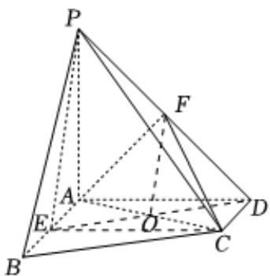

> [!faq]- 2023-2024学年内蒙古部分名校高一（下）期末数学试卷解析
>
> > [!success]- **【答案】** 详见解析
>
> > [!note]- **【解析】**
> > 详见解析
> >
> > (1)证明：因为 $AB = 2CD = 6, AB \parallel CD, AB \perp AD, F$ 为 $PD$ 的中点， $E$ 为 $AB$ 的中点，
> >
> > 连接EC，ED，设 $ED \cap AC = O$ ，连接OF，
> >
> > 可得四边形ADCE为矩形，
> >
> > 可得O为DE的中点，所以OF//PE
> >
> > 又因为 $PE\not\subset$ 平面ACE，OF⊂平面ACE，
> >
> > 所以PE//平面ACE；
> >
> > (2)证明：因为 $PA \perp$ 平面ABCD， $CD \subset$ 平面ABCD，
> >
> > 所以 $AD \perp CD$
> >
> > 易证得 $CD \perp AD, AD \cap PA = A$
> >
> > 所以 $CD \perp$ 平面PAD，
> >
> > 因为 $AF \subset$ 平面PAD，
> >
> > 所以 $AF \perp CD$
> >
> > 又因为 $PA = AD$ ， $F$ 为 $PD$ 的中点，
> >
> > 所以 $AF \perp PD$
> >
> > 又因为 $PD \cap CD = D$ ，
> >
> > 
> >
> > 所以 $AF \perp$ 平面PCD；
> >
> > (3) $PA = AD = 6$ , $AB = 2CD = 6$ ,
> >
> > 可得 $AC = \sqrt{AD^2 + CD^2} = \sqrt{36 + 9} = 3\sqrt{5}$
> >
> > $$
> > A F = \frac {1}{2} P D = \frac {1}{2} \sqrt {P A ^ {2} + A D ^ {2}} = \frac {1}{2} \sqrt {3 6 + 3 6} = 3 \sqrt {2},
> > $$
> >
> > 由（2）可得 $AF \perp$ 平面PCD，
> >
> > 所以 $\angle ACF$ 为直线 $AC$ 与平面 $PCD$ 所成的角，
> >
> > 所以 $\sin \angle ACF = \frac{AF}{AC} = \frac{3\sqrt{2}}{3\sqrt{5}} = \frac{\sqrt{10}}{5}$ .
> >
> > 所以直线AC与平面PCD所成角的正弦值为 $\frac{\sqrt{10}}{5}$ .
