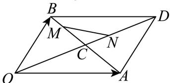

<!-- question-source:start -->
20. 如图所示，OADB是平行四边形， $\overrightarrow{OA}=\overrightarrow{e_{1}}$ ， $\overrightarrow{OB}=\overrightarrow{e_{2}}$ ，C是其对角线的交点， $\overrightarrow{BM}=\frac{1}{3}\overrightarrow{BC},\quad\overrightarrow{CN}=\frac{1}{3}\overrightarrow{CD}.$

(1)试用 $\overrightarrow{e_1}$ , $\overrightarrow{e_2}$ 表示向量 $\overrightarrow{CM}$ , $\overrightarrow{CN}$ .

(2)试用 $\overrightarrow{e_{1}}$ ， $\overrightarrow{e_{2}}$ 表示向量 $\overrightarrow{MN}$ .
<!-- question-source:end -->

![[Q00091343A1]]
