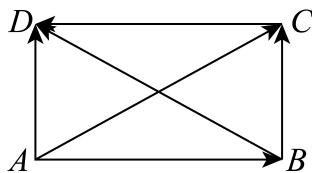

> [!faq]- 2024-2025学年3月内蒙古包头九原区包头市第九中学外国语学校高一下学期月考数学试卷解析
>
> > [!success]- **【答案】** A
>
> > [!note]- **【分析】**
> > 根据向量减法的三角形法则计算，得到四边形ABCD一定是平行四边形．再得 $\left|\overrightarrow{BD}\right|=\left|\overrightarrow{AC}\right|$ ，判定即可.
>
> > [!note]- **【解析】**
> > 如图所示，由向量减法的三角形法则，
> >
> > 得 $\overrightarrow{AC} -\overrightarrow{AB} = \overrightarrow{BC} = \overrightarrow{AD}$ ，得 $BC / / AD$ ， $BC = AD$
> >
> > 所以四边形ABCD一定是平行四边形.
> >
> > 又 $\left|\overrightarrow{BC} +\overrightarrow{BA}\right| = \left|\overrightarrow{AD} -\overrightarrow{CD}\right| = \left|\overrightarrow{AD} +\overrightarrow{DC}\right|$ ，得 $\left|\overrightarrow{BD}\right| = \left|\overrightarrow{AC}\right|$
> >
> > 所以平行四边形ABCD一定是矩形.
> >
> > 
> >
> > 故选：A.
