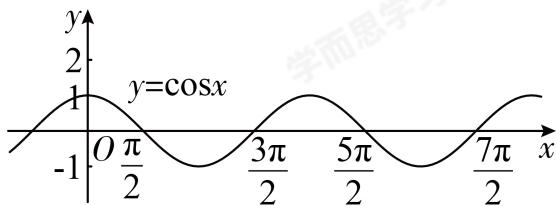

> [!faq]- 2024-2025学年3月内蒙古包头九原区包头市第九中学外国语学校高一下学期月考数学试卷解析
>
> > [!success]- **【答案】** D
>
> > [!note]- **【解析】**
> > 由题意 $f(x)=2\cos(\omega x+\varphi)$ （ $\omega>0,0<\varphi<\pi$ ）的最小正周期为T，则 $T=\frac{2\pi}{\omega}$ ,
> >
> > 又 $f(T)=\sqrt{3}$ ，可得 $\cos\left(\omega\times\frac{2\pi}{\omega}+\varphi\right)=\frac{\sqrt{3}}{2}$ ，即 $\cos\varphi=\frac{\sqrt{3}}{2}$ ，
> > 又0<φ<π，
> > 所以 $\varphi=\frac{\pi}{6}$ ， $f(x)=2\cos\left(\omega x+\frac{\pi}{6}\right)$ 在区间 $[0,1]$ 上恰有3个零点，
> > 当 $x\in[0,1]$ 时， $\omega x+\frac{\pi}{6}\in\left[\frac{\pi}{6},\omega+\frac{\pi}{6}\right]$ 函数 $y=\cos x$ 的图象如图所示。
> >
> > 函数 $y = \cos x$ 的图象如图所示，
> >
> > 
> >
> > 则 $y=\cos x$ 在原点右侧的零点依次为 $\frac{\pi}{2}$ ， $\frac{3\pi}{2}$ ， $\frac{5\pi}{2}$ ， $\frac{7\pi}{2}$ ，…，
> > 所以 $\frac{5\pi}{2}\leqslant\omega+\frac{\pi}{6}<\frac{7\pi}{2}$ ，解得 $\frac{7\pi}{3}\leqslant\omega<\frac{10\pi}{3}$ ,
> > 即 $\omega$ 的取值范围是 $\left[\frac{7\pi}{3},\frac{10\pi}{3}\right)$ .
> > 故选：D.
