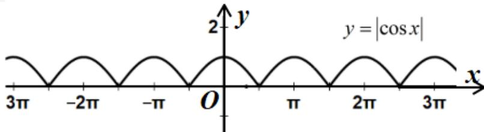

> [!faq]- 2024-2025学年3月内蒙古包头九原区包头市第九中学外国语学校高一下学期月考数学试卷解析
>
> > [!success]- **【答案】** AC
>
> > [!note]- **【解析】**
> > 解：对于A，定义域为R，因为 $f(-x)=|\cos(-x)|=|\cos x|=f(x)$ ，所以函数为偶函数，因为 $y=|\cos x|$ 的图像是由 $y=\cos x$ 的图像在x轴下方的关于x轴对称后与x轴上方的图像共同组成，所以 $y=|\cos x|$ 的最小正周期为 $\pi$ ，所以A无误，
> >
> > 
> >
> > 对于B，定义域为R，因为 $f(-x)=\sin(-2x)=-\sin 2x=-f(x)$ ，所以函数为奇函数，所以B有误，
> >
> > 对于C，定义域为 $R$ ， $f(x) = \sin \left(2x + \frac{\pi}{2}\right) = \cos 2x$ ，最小正周期为 $\pi$ ，因为 $f(-x) = \cos (-2x) = \cos 2x = f(x)$ ，所以函数为偶函数，所以C无误，
> >
> > 对于D，定义域为 $R$ ，最小正周期为 $\frac{2\pi}{\frac{1}{2}} = 4\pi$ ，所以D有误，因此正确答案为：AC
