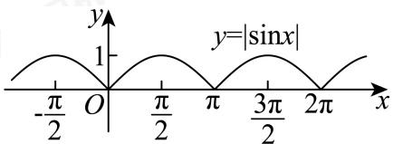

> [!faq]- 2024-2025学年3月内蒙古包头九原区包头市第九中学外国语学校高一下学期月考数学试卷解析
>
> > [!success]- **【答案】** AC
>
> > [!note]- **【分析】**
> > 利用数形结合即可作出判断.
>
> > [!note]- **【解析】**
> > 作出函数 $f(x)=|\sin x|$ 图象，如图：
> >
> > 
> >
> > 根据图象可知： $f(x)$ 的最大值为1，故A正确， $f(x)$ 在 $\left(-\frac{\pi}{2},0\right)$ 上是减函数，故B错误，$\pi$ 为 $f(x)$ 的一个周期，故C正确，
> >
> > $f(x)$ 在 $[0, 2\pi]$ 上有三个零点，故D错误，
> >
> > 故选：AC.
