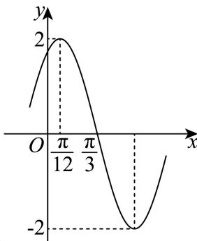

<!-- question-source:start -->
11. 已知函数 $f(x) = A\sin (\omega x + \varphi) \left( A > 0, \omega > 0, |\varphi| < \frac{\pi}{2} \right)$ 部分图象如图所示，则下列说法正确的是（）

A. $\omega = 2$

B. $f(x)$ 的图象关于点 $\left(-\frac{2\pi}{3},0\right)$ 对称  
C.将函数 $y = 2\cos \left(2x + \frac{\pi}{3}\right)$ 的图象向右平移 $\frac{\pi}{2}$ 个单位得到函数 $f(x)$ 的图象  
D.若方程 $f(x) = m$ 在 $\left[0,\frac{\pi}{2}\right]$ 上有且只有一个实数根，则 $m$ 的取值范围是 $\left[-\sqrt{3},\sqrt{3}\right)$
<!-- question-source:end -->

![[Q00092106A1]]
