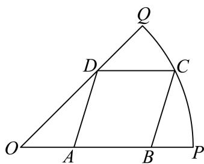

<!-- question-source:start -->
16. 为迎接大运会的到来, 学校决定在半径为 $20 \sqrt{2} \mathrm{~m}$ , 圆心角为 $\frac{\pi}{4}$ 的扇形空地 $OPQ$ 的内部修建一平行四边形观赛场地 $ABCD$ , 如图所示, 则观赛场地的面积最大值为 $\_ \mathrm{m}^{2}$ .

<!-- question-source:end -->

![[Q00092111A1]]
