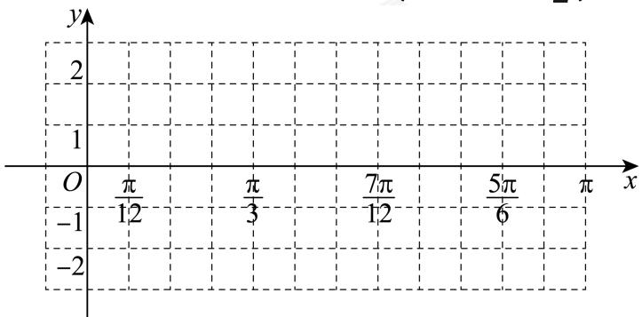

<!-- question-source:start -->
18. 函数 $f(x) = 2\sin (2x + \varphi)\left(0 < \varphi < \frac{\pi}{2}\right)$ 的一个对称中心是 $\left(\frac{\pi}{3}, 0\right)$ .

(1)求函数 $f(x)$ 的最值及x为何值时取到；

(2)用“五点法”画出函数 $f(x)$ 在 $[0,\pi]$ 上的简图.
<!-- question-source:end -->

![[Q00092644A1]]
