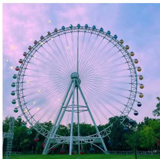
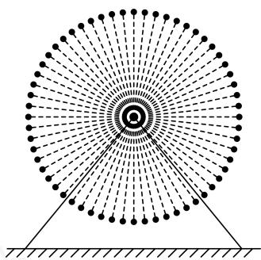

<!-- question-source:start -->
21. 位于郑州海昌海洋旅游度假区内的“郑州之眼”摩天轮是目前中原地区最高的摩天轮。该摩天轮的最高点距离地面的高度约为105米，最低点距离地面约为15米，摩天轮上均匀设置了60个座舱。开启后摩天轮按逆时针方向匀速转动，游客在座舱离地面最近时的位置进入座舱，摩天轮转完一周后在相同的位置离开座舱。摩天轮转一周大约需要30分钟，当游客甲坐上摩天轮的座舱开始计时。

（1）经过 $t$ 分钟后游客甲距离地面的高度为 $H$ 米，求 $\pmb{H}(t)$ 的解析式；

（2）游客甲坐上摩天轮后多长时间，距离地面的高度恰好为37.5米？

(3) 若游客乙在游客甲之后进入座舱, 且中间间隔9个座舱, 从甲进入座舱开始计时, 在摩天轮转动一周的过程中, 记两人距离地面的高度差为 $h$ 米, 求 $h$ 的最大值及此时的时间 $t$ .
<!-- question-source:end -->

![[Q00092647A1]]
